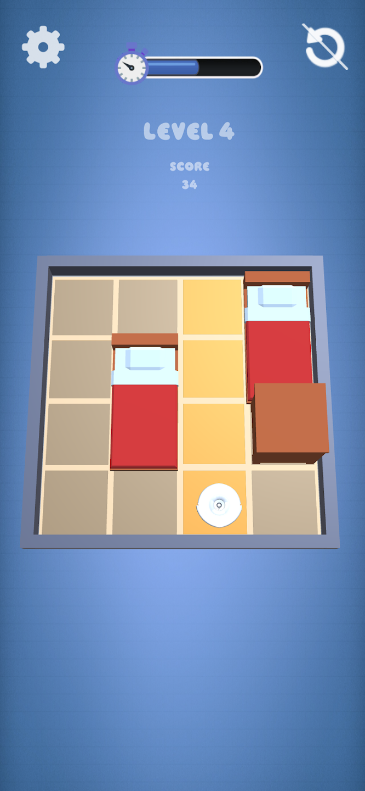
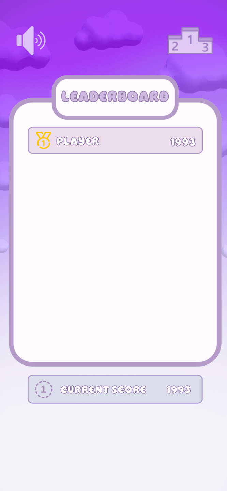

# Maze Cleaner
**Links:**
- [Google Play Store Link](https://play.google.com/store/apps/details?id=com.WhateverWorks.MazeCleaner)

**Description**  
Maze Cleaner is a puzzle game where players navigate through procedurally generated mazes. The objective is to clear the maze while avoiding obstacles, and the game features a leaderboard to track the best times and scores.

**Features:**
- Procedurally generated mazes using ML learning algorithms.
- A leaderboard to compete with others based on performance.
- Interactive sound design created with Audacity.

**Technologies Used:**
- Unity
- C#
- ML Learning for map generation
- Audacity for sound design
- Free-to-use 3D models (modified for the game)

**Platforms:**
- Android

**Credits:**
- 3D models: Free-for-use models that were modified and implemented into the game.

---
Feel free to check out my other projects on GitHub!
